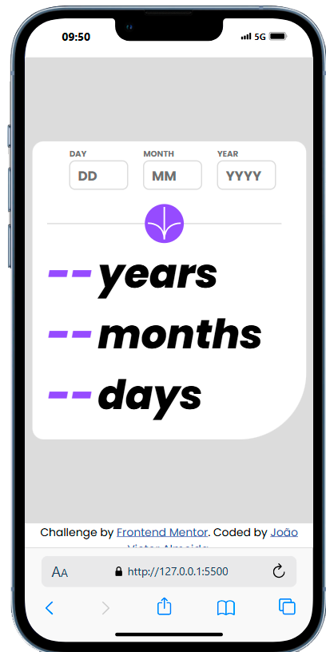

# Calculator App

## 📜Descrição (Português)

O projeto "Age Calculator App" me ajudou a aprimorar habilidades essenciais em programação, especialmente na manipulação de datas e cálculos precisos. Com ele, aprendi a capturar e tratar dados de usuário, além de organizar e apresentar informações de forma clara. Esse desenvolvimento reforçou minha lógica e estruturação de código, preparando-me para desafios mais complexos.

## Funcionalidades

- Inserção de data de nascimento
- Cálculo instantâneo da idade exata
- Exibição em anos, meses e dias

## 💻 Tecnologias Utilizadas

 
  
  
  

## Demonstração

### Versão desktop

### Versão mobile

## 🚀 Como Usar

- Clone o repositório: git clone https://github.com/Victor1x/Age-calculator-app.git
- Abra o arquivo index.html no seu navegador.
- Insira sua data de nascimento no campo fornecido.
- O aplicativo calculará automaticamente sua idade exata.
- Veja o resultado detalhado em anos,
  meses e dias.

# English Description

The "Age Calculator App" project helped me enhance essential programming skills, especially in date manipulation and precise calculations. Through it, I learned how to capture and handle user input and organize and present information clearly. This development strengthened my logic and code structuring, preparing me for more complex challenges ahead.

## Features

- Birthdate input field
- Instant calculation of exact age
- Display in years, months, and days

## 💻Technologies Used

 
  
  
  

## 🚀How to Use

- Clone the repository: git clone https://github.com/Victor1x/Age-calculator-app.git
- Open the index.html file in your browser.
- Enter your date of birth in the provided field.
- The app will automatically calculate your exact age.
- View the detailed result in years, months, and days.
